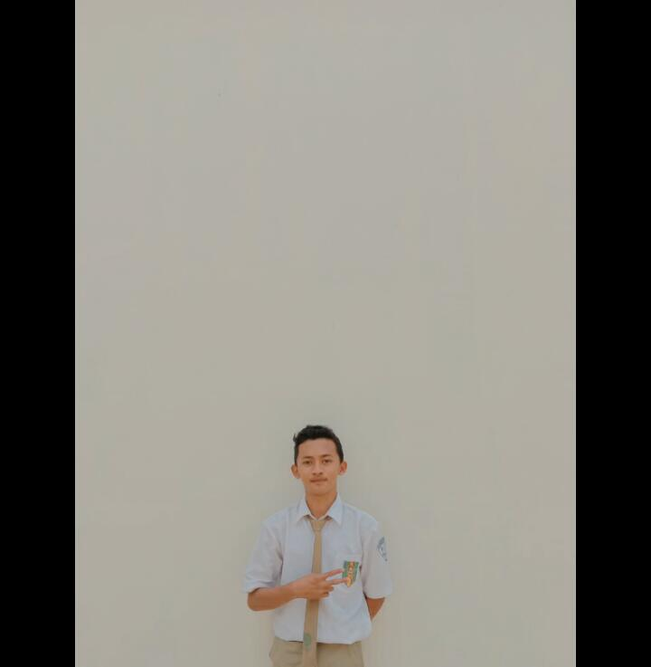

<!-- ## Hi there 👋 -->

<!--
**valdhanooo/valdhanooo** is a ✨ _special_ ✨ repository because its `README.md` (this file) appears on your GitHub profile.

Here are some ideas to get you started:

- 🔭 I’m currently working on ...
- 🌱 I’m currently learning ...
- 👯 I’m looking to collaborate on ...
- 🤔 I’m looking for help with ...
- 💬 Ask me about ...
- 📫 How to reach me: ...
- 😄 Pronouns: ...
- ⚡ Fun fact: ...
-->
# Hi there, I'm Muhammad Valdhano! 👋
<!--  -->
### A Full-Stack Developer with a passion for Mobile & Web Applications.

---

  &nbsp;
  &nbsp;
  

---

### 👨‍💻 About Me

Saya adalah seorang mahasiswa **Sistem Informasi** di **Universitas Pamulang** yang memiliki antusiasme tinggi dalam membangun solusi digital. Saya fokus pada pengembangan aplikasi mobile menggunakan **Flutter** dan membangun sisi backend dengan **PHP & MySQL**.

<!-- - 🔭 Saat ini saya sedang mengerjakan **[Nama Proyek Kuliah/Pribadi Anda]**.
- 🌱 Saya sedang mendalami **[Teknologi Baru yang Sedang Dipelajari]**.
- 👯 Saya terbuka untuk berkolaborasi dalam proyek-proyek menarik untuk menambah pengalaman.
- 📫 Hubungi saya jika Anda ingin berdiskusi tentang teknologi atau peluang magang/proyek!

- 🔭 Saat ini saya sedang mengerjakan **[Nama Proyek Anda Saat Ini]**.
- 🌱 Saya sedang mendalami **[Teknologi Baru yang Sedang Dipelajari]**.
- 👯 Saya terbuka untuk berkolaborasi dalam proyek open-source atau ide-ide menarik lainnya.
- 📫 Hubungi saya jika Anda ingin berdiskusi tentang teknologi atau peluang kerja sama! -->

---

### 💻 My Tech Stack

Berikut adalah beberapa teknologi yang saya kuasai:

  <strong>Languages & Frameworks:</strong> 
  
  
    
  <strong>Database:</strong> 
  
    
  <strong>Design & Tools:</strong> 
  
  

---

<!-- ### 📊 My GitHub Stats

<table>
  <tr>
    <!-- <td valign="top" width="50%">
      
    </td>
    <td valign="top" width="50%">
      
    </td> -->
  <!-- </tr>
  <tr>
    <td colspan="2" align="center">
      
    </td>
  </tr>
</table> -->

---

<!-- ### 🚀 My Projects

Berikut adalah beberapa proyek yang telah saya kerjakan. Anda bisa melihat lebih banyak di repositori saya!

<table>
  <tr>
    <td width="50%">
      
    </td>
    <td width="50%">
      
    </td>
  </tr>
</table> -->

---
<!-- 

  

 -->